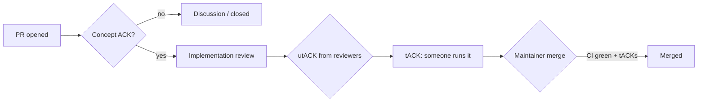

The first time I saw "Concept ACK" on an LND pull request, I assumed it meant approval. It doesn't — or rather, it means a much narrower kind of approval than the green checkmark implies, and figuring out the difference took me longer than it should have.

## The vocabulary

- **Concept ACK** — "I agree with the *idea*, I haven't reviewed the code." Someone is signaling the change is worth pursuing before anyone spends review time on implementation details.
- **utACK** (untested ACK) — "I reviewed the code and it looks correct, but I haven't run it."
- **tACK** (tested ACK) — "I reviewed the code *and* ran it / tested the behavior described."
- **NACK** — disagreement, ideally with a reason attached. An unqualified NACK without justification tends to get pushed back on just as much as an unqualified approval would.

This vocabulary, borrowed from Bitcoin Core's review culture, exists because "LGTM" collapses several very different confidence levels into one signal. A maintainer scanning a queue of thirty PRs needs to know whether three "approvals" mean three people ran the code, or three people skimmed the diff and liked the idea.

## Review flow

The bottleneck is almost never Concept ACK — most reasonable ideas get one quickly. It's getting from utACK to tACK: someone has to actually pull the branch, build it, and exercise the changed code path, which for a Lightning node often means standing up a local multi-node network (this is, not coincidentally, most of what Polar exists to make fast).

## Where good-first-issues fit

LND's `good-first-issue` label tends to mark changes where the *implementation* is small but the *review bar* is still the full vocabulary above — a one-line fix still needs a tACK before it merges into code that moves other people's funds. That's a useful thing to internalize early: in most codebases, PR size and review rigor are correlated. In consensus-adjacent or fund-custody code, they're decoupled on purpose.

## What I'd tell someone starting out

Don't read "Concept ACK, needs review" as "almost merged." Read it as "worth continuing to work on." And when you leave a review yourself, say which kind of ACK it is — it costs one word and saves the maintainer a guess.
